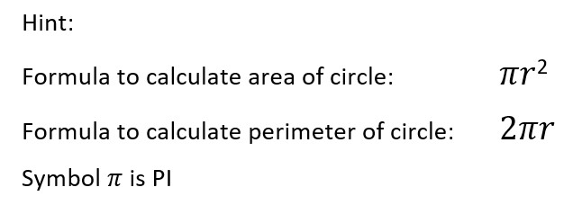
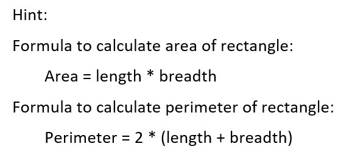
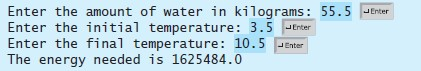
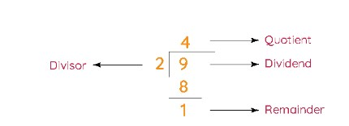

### Input, Output & Arithmetic Operator

1. Write a program to accept two integer numbers from user. And perform addition and substraction. Display the reuslts of the operation on console.

2. Write a program to accept two floating point numbers from user. And perform multiplication and division on the numbers. Display the result on console.

3. Write a program to accept radius of circle from user. And calculate area and perimeter of circle. Display the result on console.

4. Write a program to accept length and breadth of rectangle from user. And calculate area and perimeter of rectangle. Display the result on console.

5. Write a program that reads a Celsius degree in a
double value from the console, then converts it to Fahrenheit and displays the result.

    >The formula for the conversion is as follows:
    >fahrenheit = (9 / 5) * celsius + 32

    >Hint: In C++, 9 / 5 is 1, but 9.0 / 5 is 1.8.

6. Write a program that calculates the energy needed to
heat water from an initial temperature to a final temperature. Your program should prompt the user to enter the amount of water in kilograms and the initial and final temperatures of the water.

    >The formula to compute the energy is
    >Q = M * (finalTemperature – initialTemperature) * 4184

    >where M is the weight of water in kilograms temperatures are in degrees Celsius, and energy Q is measured in joules. 
    
    Here is a sample run:
    
    

7. If you know the balance and the annual percentage interest rate, you can compute the interest on the next monthly payment using the following formula:

    >interest = balance x (annualInterestRate/1200)

    Write a program that reads the balance and the annual percentage interest rate and displays the interest for the next month.

8. Ravi and Shyam were playing a game. In the first turn of the game, Ravi will give an integer dividend and an integer divisor to Shyam. Then Shyam has to tell him the remainder of the division. In the second turn, Shyam will repeat the procedure. 

    To help them, please write a program that accepts Dividend, and Divisor from the user and print the remainder on the console.
    