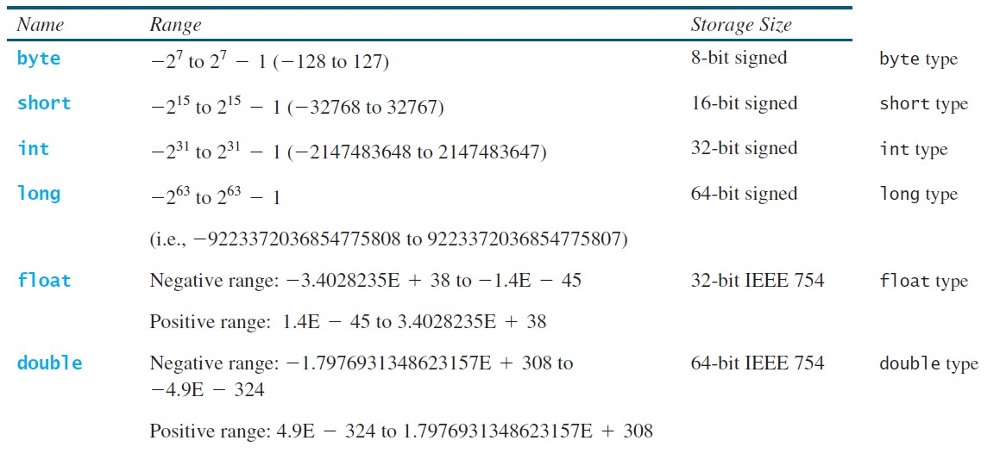
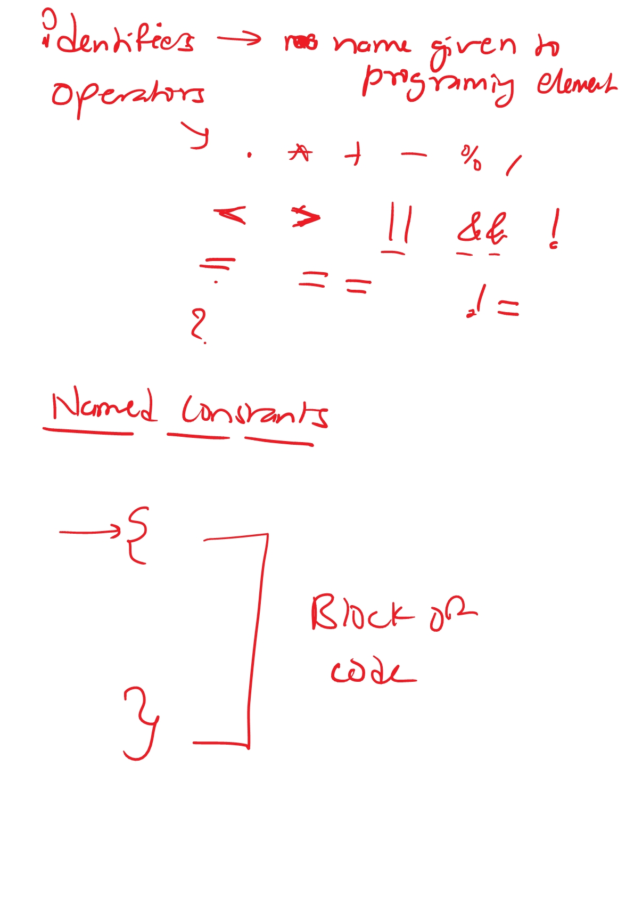
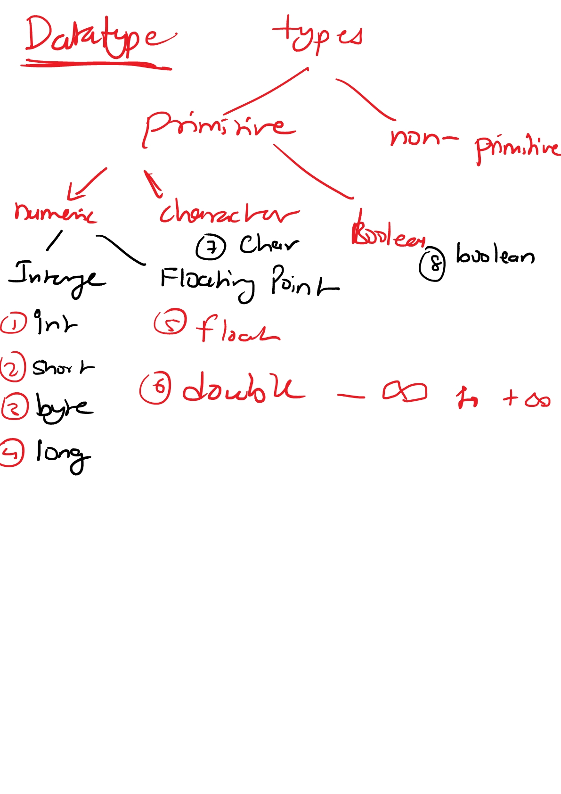
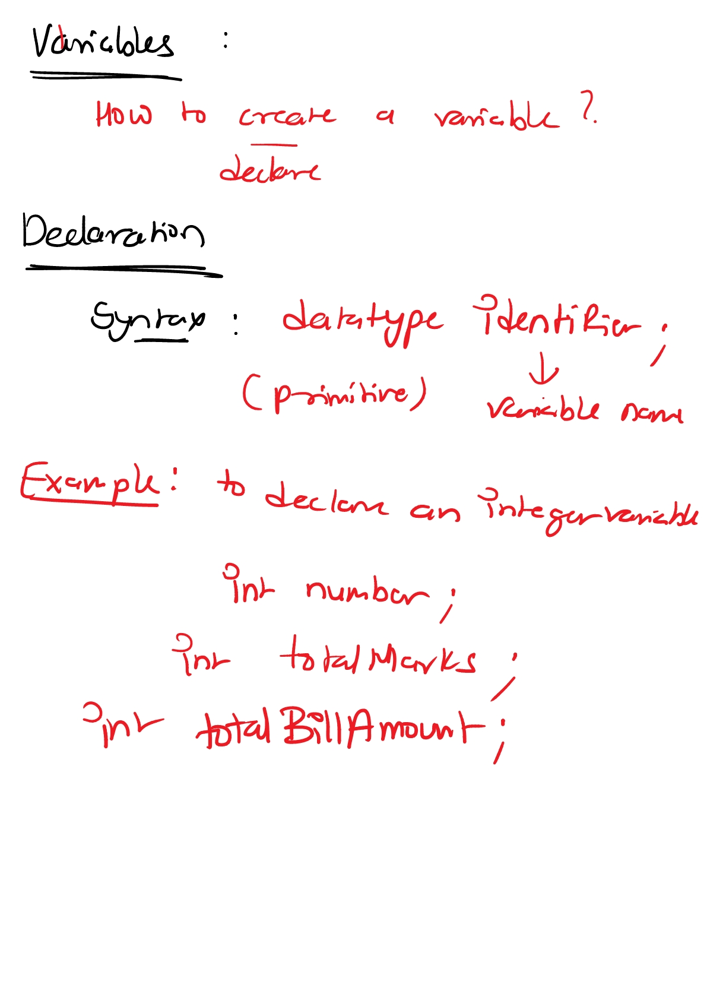
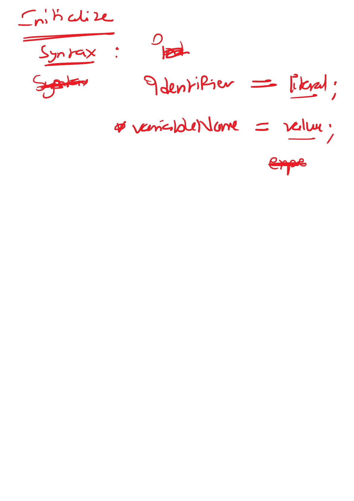
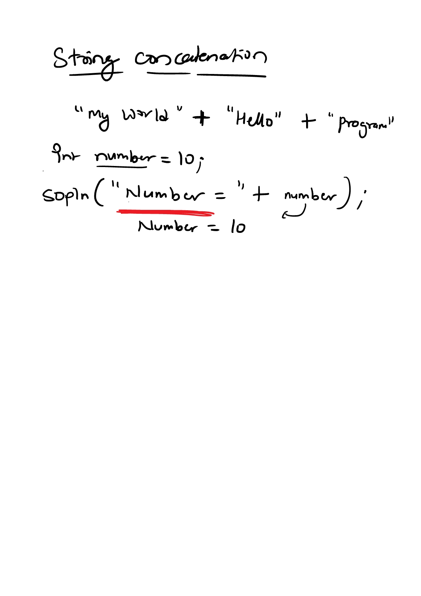

# Datatype and Variables

Java defines eight primitive types of data: ***byte, short, int, long, char, float, double, and boolean***. The primitive types are also commonly referred to as
simple types. 

These can be put in four groups:
- **Integers -** This group includes ***byte, short, int, and long***, which are for whole-valued signed numbers.
- **Floating-point numbers -** This group includes ***float and double***, whichrepresent numbers with fractional precision.
- **Characters -** This group includes ***char***, which represents symbols in a character set, like letters and numbers.
- **Boolean -** This group includes ***boolean***, which is a special type for representing true/false values.
### Datatype Range

#### Page 1

#### Page 2

#### Page 3

#### Page 4

#### Page 5
